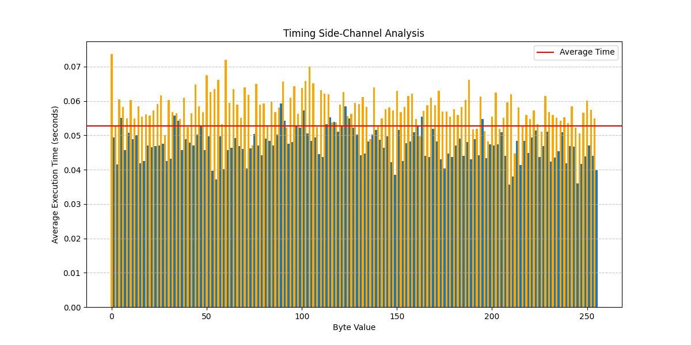

# Side-Channel Attacks & Countermeasures

A comprehensive simulation of side-channel attacks on cryptographic implementations, featuring practical demonstrations of timing attacks and power analysis against AES encryption. This project includes robust countermeasures to mitigate vulnerabilities and detailed security impact analysis comparing protected vs vulnerable implementations.

## Project Overview

This repository contains a semester project for Information Security that implements and analyzes side-channel attacks against cryptographic systems. Side-channel attacks exploit physical implementation characteristics rather than the mathematical security of the cryptographic algorithms themselves.

### Implemented Attacks

1. **Timing Attack**: Demonstrates how variations in execution time can leak information about secret keys
2. **Power Analysis Attack**: Simulates Differential Power Analysis (DPA) to extract key information from power consumption patterns

### Implemented Countermeasures

1. **Against Timing Attacks**:
   - Constant-time operations
   - Time normalization
   - Random delays

2. **Against Power Analysis**:
   - Data masking
   - Power consumption randomization
   - Operation blinding and shuffling

## Project Structure

```
/implementation
├── src/                          # Source code
│   ├── aes_implementation.py     # Vulnerable AES implementation
│   ├── timing_attack.py          # Timing attack demonstration
│   ├── power_analysis.py         # Power analysis attack demonstration
│   └── countermeasures.py        # Countermeasures implementation
├── tests/                        # Test cases
│   ├── test_timing_attack.py     # Tests for timing attack
│   ├── test_power_analysis.py    # Tests for power analysis attack
│   └── test_countermeasures.py   # Tests for countermeasure effectiveness
├── docs/                         # Documentation
│   ├── security_analysis.md      # Security impact analysis
│   └── figures/                  # Generated visualizations
│       ├── timing_attack_visualization.png
│       ├── power_traces_comparison.png
│       └── power_analysis_byte_*.png
└── requirements.txt              # Project dependencies
```

## Getting Started

### Prerequisites

- Python 3.8+
- Required Python packages (install via pip):
  ```
  pip install -r requirements.txt
  ```

### Running the Demonstrations

1. **Run the timing attack demonstration**:
   ```
   python src/timing_attack.py
   ```

2. **Run the power analysis attack demonstration**:
   ```
   python src/power_analysis.py
   ```

3. **Run the countermeasures demonstration**:
   ```
   python src/countermeasures.py
   ```

### Running the Tests

To run all tests:
```
python -m unittest discover tests
```

To run a specific test:
```
python -m unittest tests.test_timing_attack
```

## Results and Analysis

The project demonstrates:

1. **Attack Effectiveness**: Side-channel attacks are able to extract cryptographic keys from implementations without exploiting mathematical weaknesses in the algorithm itself
2. **Countermeasure Impact**: The implemented countermeasures significantly reduce the effectiveness of the attacks
3. **Security-Performance Trade-offs**: The security benefits of countermeasures come with performance costs

For detailed analysis, see the [security_analysis.md](docs/security_analysis.md) document.

### Visualizations

The demonstrations generate visualizations that show:

1. **Timing Attack Results**: Correlation between input values and execution time
2. **Power Analysis**: Power consumption traces and their correlation with key values
3. **Countermeasure Effectiveness**: Comparison of vulnerable vs protected implementations

Example visualization:



## Technical Details

### Vulnerable AES Implementation

The project includes a deliberately vulnerable AES implementation with:
- Data-dependent timing characteristics
- Observable power consumption patterns correlated with processed data
- No side-channel protections

### Countermeasure Techniques

1. **Constant-time operations**: Ensures cryptographic operations take the same amount of time regardless of data values
2. **Data masking**: Uses random values to hide the actual data being processed
3. **Operation blinding**: Adds random factors to prevent attackers from controlling inputs precisely
4. **Operation shuffling**: Randomly changes operation order to break correlation with power traces

## Academic Context

This repository is part of an Information Security course project focused on advanced cryptographic implementation security.

## License

This project is provided for educational purposes only. Use responsibly.

## Acknowledgments

- Based on theoretical foundations from academic papers on side-channel attacks
- Inspired by real-world security vulnerabilities in cryptographic implementations