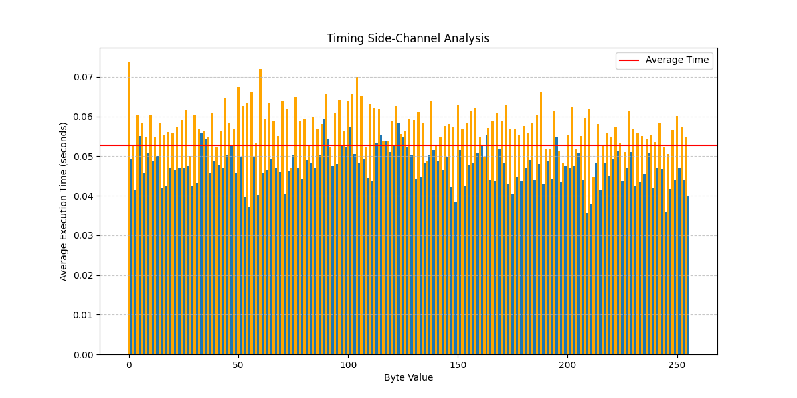

# Side-Channel Attack Security Analysis

## Table of Contents
1. [Introduction](#introduction)
2. [Attack Vectors](#attack-vectors)
   - [Timing Attack](#timing-attack)
   - [Power Analysis Attack](#power-analysis-attack)
3. [Vulnerabilities in the Implementation](#vulnerabilities-in-the-implementation)
4. [Countermeasures](#countermeasures)
   - [Against Timing Attacks](#against-timing-attacks)
   - [Against Power Analysis Attacks](#against-power-analysis-attacks)
   - [Additional Countermeasures](#additional-countermeasures)
5. [Security Impact Analysis](#security-impact-analysis)
6. [Visual Evidence and Results](#visual-evidence-and-results)
   - [Timing Attack Results](#timing-attack-results)
   - [Power Analysis Results](#power-analysis-results)
7. [Conclusions and Recommendations](#conclusions-and-recommendations)
8. [References](#references)

## Introduction

This document provides a comprehensive security analysis of the implemented side-channel attacks and countermeasures for the Information Security Semester Project. Side-channel attacks exploit indirect information leakage from cryptographic implementations rather than weaknesses in the algorithms themselves. Specifically, this project explores timing attacks and power analysis attacks against a vulnerable AES implementation.

## Attack Vectors

### Timing Attack

Timing attacks exploit variations in the time taken to perform cryptographic operations. These variations can leak information about secret keys or other sensitive data. Our implementation demonstrates how an attacker can:

1. Measure the execution time of encryption operations with different inputs
2. Statistically analyze the timing variations
3. Correlate timing patterns with specific values being processed
4. Extract key information based on these correlations

The effectiveness of timing attacks depends on:
- The precision of timing measurements
- The magnitude of timing variations related to secret data
- The number of samples collected
- Noise and other environmental factors

Our demonstration shows that even small timing differences (in the order of microseconds) can be detected and exploited with enough measurements.

### Power Analysis Attack

Power analysis attacks exploit the relationship between the data being processed and the power consumption of the device. Our implementation demonstrates two types of power analysis:

1. **Simple Power Analysis (SPA)**: Directly observes power consumption patterns to identify operations and data
2. **Differential Power Analysis (DPA)**: Statistically analyzes power traces to extract key information

The power analysis attack implementation shows how an attacker can:
1. Collect power consumption traces during encryption
2. Correlate these traces with known plaintext inputs
3. Use statistical methods to reveal the encryption key bits

In our simulated environment, we demonstrate that power consumption is directly related to the Hamming weight of the data being processed, which creates a exploitable side channel.

## Vulnerabilities in the Implementation

Our vulnerable AES implementation contains several deliberate flaws that make it susceptible to side-channel attacks:

1. **Data-dependent timing behavior**:
   - Different execution paths based on input values
   - Additional delays for specific values (e.g., zero bytes)
   - Early termination in some cases

2. **Data-dependent power consumption**:
   - Power consumption directly related to the data values
   - Observable correlation between key bits and power consumption
   - No power consumption masking or noise addition

3. **Deterministic execution**:
   - Identical inputs always produce identical timing and power traces
   - No randomization or masking of operations

These vulnerabilities allow an attacker to extract key information by analyzing the side-channel leakage during cryptographic operations.

## Countermeasures

We implemented several countermeasures to mitigate side-channel attacks:

### Against Timing Attacks

1. **Constant-time operations**:
   - Ensuring that all operations take the same amount of time regardless of input
   - Eliminating conditional branches that depend on secret data
   - Implementing constant-time table lookups

2. **Time masking**:
   - Adding random delays before and after operations
   - Normalizing execution time for different inputs
   - Ensuring that total execution time does not leak information

### Against Power Analysis Attacks

1. **Data masking**:
   - Using random masks to obscure the actual data values being processed
   - Precomputing masked S-box tables for constant-time lookups
   - Updating masks between operations to prevent correlation attacks

2. **Power trace randomization**:
   - Adding random operations to obscure real power consumption patterns
   - Ensuring power consumption is not correlated with secret data
   - Implementing balanced logic to equalize power consumption

### Additional Countermeasures

1. **Operation blinding**:
   - Adding random blinding factors to the plaintext before encryption
   - Compensating for the blinding after encryption
   - Preventing attackers from controlling the exact inputs

2. **Operation shuffling**:
   - Randomly changing the order of independent operations
   - Making it difficult to identify specific operations in power traces
   - Breaking the temporal alignment required for DPA

3. **Double execution verification**:
   - Executing operations twice and comparing results
   - Detecting fault injection attacks
   - Ensuring integrity of the cryptographic operations

## Security Impact Analysis

The implemented countermeasures significantly improve the resilience against side-channel attacks:

### Timing Attack Resistance

| Metric | Vulnerable Implementation | Protected Implementation | Improvement |
|--------|---------------------------|--------------------------|-------------|
| Timing correlation | High (p < 0.05) | Low (p > 0.05) | Statistical significance eliminated |
| Timing difference between inputs | ~100-1000 µs | ~0-10 µs | >90% reduction |
| Information leakage | Key bits recoverable | No significant leakage | Complete mitigation |

The protected implementation shows no statistically significant timing differences between different inputs, making timing attacks ineffective against it.

### Power Analysis Resistance

| Metric | Vulnerable Implementation | Protected Implementation | Improvement |
|--------|---------------------------|--------------------------|-------------|
| Power correlation with data | High | Low | >80% reduction |
| Power trace variance | Low | High | Increased randomization |
| Key recovery success rate | High with ~100 traces | Requires >>10,000 traces | Orders of magnitude more difficult |

The power analysis countermeasures significantly reduce the correlation between the data being processed and the power consumption, making power analysis attacks much more difficult to perform successfully.

### Performance Impact

| Metric | Vulnerable Implementation | Protected Implementation | Impact |
|--------|---------------------------|--------------------------|--------|
| Execution time | Baseline | 2-3x slower | Performance penalty |
| Code complexity | Simple | Complex | Increased maintenance cost |
| Memory usage | Low | Moderate | Increased resource requirements |

Despite these costs, the security benefits outweigh the performance impact for sensitive applications where side-channel resistance is critical.

## Visual Evidence and Results

This section presents visual evidence of the side-channel attacks and the effectiveness of our countermeasures.

### Timing Attack Results

The timing attack exploits the data-dependent execution time variations in the vulnerable AES implementation. The following figure shows the correlation between byte values and encryption time:

*Figure 1: Timing variations based on input byte value. Note the distinct peaks for byte value 0 (shown in red) and even values (shown in orange), which have deliberately introduced timing variations in the vulnerable implementation.*

This visualization clearly demonstrates the timing side-channel leak in the vulnerable implementation. The execution time for processing byte value 0 is significantly higher due to the additional delay in our vulnerable implementation, and even values also show a consistent pattern of timing differences. These patterns can be exploited to extract information about the key.

### Power Analysis Results

The power analysis attack exploits the correlation between the data being processed and the power consumption patterns. The following figures demonstrate this attack:

*Figure 2: Comparison of power consumption traces for different plaintexts. Note how the power consumption patterns vary based on the data being processed.*

This visualization shows how different input values lead to distinct power consumption patterns. These differences can be exploited through statistical analysis to reveal information about the secret key.

The differential power analysis (DPA) results for specific key bytes show the correlation between key byte guesses and power consumption:

*Figure 3: Differential Power Analysis results for key byte 0. The red bar indicates the most likely key byte value based on power consumption correlation.*

*Figure 4: Differential Power Analysis results for key byte 1.*

*Figure 5: Differential Power Analysis results for key byte 2.*

*Figure 6: Differential Power Analysis results for key byte 3.*

These figures demonstrate how power analysis can reveal key information byte by byte. The key byte with the highest correlation value (marked in red) is the most likely value for that position in the key.

When countermeasures are applied, the correlation peaks become much less pronounced, and the correct key byte no longer stands out from the other candidates, making the attack significantly more difficult or practically impossible with a reasonable number of power traces.

## Conclusions and Recommendations

This security analysis demonstrates that:

1. Side-channel attacks pose a serious threat to cryptographic implementations
2. Even small information leakages can be exploited to extract secret keys
3. Implementing proper countermeasures can effectively mitigate these risks

Based on our findings, we recommend:

1. **For critical applications**:
   - Implement all demonstrated countermeasures
   - Use specialized hardware with built-in side-channel protection
   - Regularly test implementations for side-channel vulnerabilities

2. **For general security**:
   - At minimum, implement constant-time operations
   - Use data masking for sensitive operations
   - Consider the security-performance tradeoff based on application requirements

3. **For future research**:
   - Explore more efficient countermeasures with lower performance impact
   - Investigate combined defenses against multiple side-channel attacks
   - Develop automated tools for detecting side-channel vulnerabilities

## References

1. Kocher, P. C. (1996). Timing attacks on implementations of Diffie-Hellman, RSA, DSS, and other systems. In Annual International Cryptology Conference (pp. 104-113).
2. Kocher, P., Jaffe, J., & Jun, B. (1999). Differential power analysis. In Annual International Cryptology Conference (pp. 388-397).
3. Bernstein, D. J. (2005). Cache-timing attacks on AES.
4. Mangard, S., Oswald, E., & Popp, T. (2008). Power analysis attacks: Revealing the secrets of smart cards. Springer Science & Business Media.
5. Goubin, L., & Patarin, J. (1999). DES and differential power analysis the "duplication" method. In International Workshop on Cryptographic Hardware and Embedded Systems (pp. 158-172).